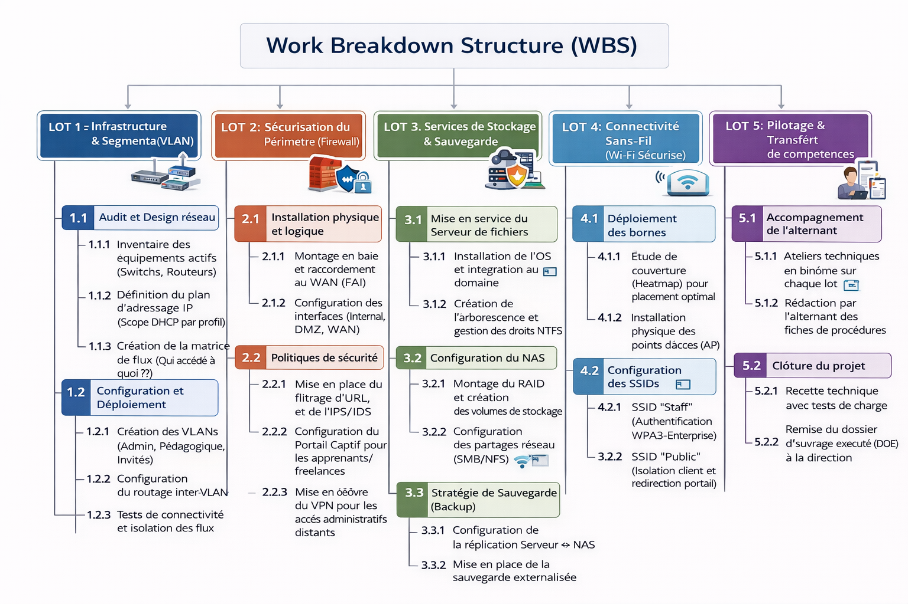

# 🏫 Modernisation de l’infrastructure IT d’un campus

## 📌 Énoncé du challenge

### 🖥️ Contexte
Vous êtes responsable de l’informatique au sein d’un campus de formation professionnelle (en présentiel 😁).  
Le campus accueille environ 500 personnes :  
- 👩‍💼 15 salariés permanents  
- 👨‍🏫 Formateurs freelances et occasionnels  
- 👩‍🎓 Apprenants en formation continue et alternance  

La direction souhaite moderniser l’infrastructure IT pour accueillir de nouveaux services numériques : serveurs fichiers, NAS, firewall, VLAN et Wi-Fi sécurisé.  

Dans votre service, un alternant est présent et sera formé et impliqué tout au long du projet.  

### 📋 Consignes
Rédigez la fiche de cadrage du projet comprenant :  
- Objectifs du projet  
- Périmètre et exclusions  
- Parties prenantes (interne / externe)  
- Livrables principaux  
- Contraintes Qualité / Coût / Délai  

---

## 📄 Fiche de cadrage du projet (Énoncé E1)

### 1️⃣ Objectifs du projet

- ⚙️ **Modernisation de l’infrastructure** : Déployer une architecture IT moderne et fiable supportant les nouveaux services numériques.
- 🔒 **Sécurisation du SI** : Mettre en œuvre un firewall et une segmentation réseau (VLAN) afin d’isoler les flux par typologie d’utilisateurs.
- 📶 **Connectivité performante** : Offrir un accès Wi-Fi sécurisé, stable et performant pour l’ensemble des usagers.
- 🗄️ **Centralisation des données** : Assurer le stockage, la disponibilité et la sauvegarde des données via un serveur de fichiers et un NAS.
- 🚀 **Évolutivité** : Concevoir une infrastructure capable d’évoluer sans refonte majeure.
- 👨‍💻 **Transfert de compétences** : Former et accompagner l’alternant sur l’ensemble des phases du projet.
- ⚡ **Performance** : Garantir un temps d’accès aux ressources réseau et fichiers inférieur à 3 secondes en conditions normales d’utilisation.

---

### 2️⃣ Périmètre et exclusions

| Domaine | Inclus dans le périmètre | Hors périmètre |
|-------|--------------------------|---------------|
| **Infrastructure** | Firewall, VLAN, bornes Wi-Fi | Travaux de câblage lourd et génie civil |
| **Serveurs & stockage** | Serveur de fichiers, NAS, sauvegardes | Maintenance des applications métiers |
| **Matériel utilisateur** | Accès réseau et authentification | Réparation PC, tablettes, smartphones |
| **Accompagnement** | Documentation et formation alternant | Support pédagogique aux apprenants |
| **Logiciel** | Services réseau et stockage | Logiciels pédagogiques spécifiques |

---

### 3️⃣ Parties prenantes

| Type | Acteur | Rôle |
|-----|-------|------|
| **Interne** | Direction du campus | Commanditaire, validation budgétaire |
| **Interne** | Responsable IT | Pilotage du projet et décisions techniques |
| **Interne** | Alternant | Participation aux déploiements et apprentissage |
| **Interne** | Salariés | Utilisateurs du réseau administratif |
| **Interne** | Apprenants | Utilisateurs Wi-Fi et ressources partagées |
| **Externe** | Formateurs freelances | Accès réseau sécurisé |
| **Externe** | Fournisseurs IT | Fourniture matériel et support |
| **Externe** | FAI | Accès Internet et connectivité |

---

### 4️⃣ Livrables principaux

| Catégorie | Livrable | Description |
|----------|---------|------------|
| 🔧 Technique | Infrastructure réseau | Firewall, VLAN et Wi-Fi opérationnels |
| 🔧 Technique | Serveur & NAS | Partages fichiers, droits et sauvegardes |
| 🔧 Technique | Portail captif | Authentification Wi-Fi sécurisée |
| 📑 Document | Schéma d’architecture | Topologie réseau, plan IP et VLAN |
| 📑 Document | Dossier d’exploitation | Procédures d’administration et sauvegarde |
| 📑 Document | Guides utilisateurs | Connexion Wi-Fi et accès aux ressources |
| 📑 Document | Dossier de formation alternant | Supports et procédures techniques |

---

### 5️⃣ Contraintes Qualité / Coût / Délai

| Axe | Contrainte | Description |
|----|-----------|-------------|
| **Qualité** | Disponibilité | 99 % de disponibilité en heures ouvrées |
| **Qualité** | Sécurité | Conformité RGPD et isolation des flux |
| **Coût** | Budget | Enveloppe validée par la direction |
| **Ressources** | Équipe | Responsable IT + alternant |
| **Délai** | Mise en service | Avant la rentrée 2026 |
| **Organisation** | Interventions | Soirs et week-ends uniquement |

---

## 🧩 Work Breakdown Structure – WBS (Énoncé E2)

Ce WBS détaille la décomposition technique du projet par grands lots fonctionnels pour garantir une mise en œuvre structurée.

## ⚠️ Analyse des risques (Énoncé E3)

Ce registre identifie les menaces potentielles du projet, leur évaluation et les mesures de prévention associées.

### 📊 Registre des risques

| ID | Catégorie | Risque identifié | Probabilité | Impact | Criticité | Mesure d'atténuation (Prévention) |
|:---|:---|:---|:---:|:---:|:---:|:---|
| **R1** | **Technique** | Panne matérielle au déballage (DOA) | Faible | Moyen | **2** | Vérification immédiate et garantie constructeur J+1. |
| **R2** | **Humain** | Accident ou absence prolongée de l'alternant | Moyenne | Faible | **2** | Documentation systématique pour reprise par le tuteur. |
| **R3** | **Organisation** | Retard de livraison des équipements (pénurie) | Forte | Moyen | **6** | Commande anticipée dès la validation du cadrage. |
| **R4** | **Technique** | Incompatibilité entre le Firewall et le FAI actuel | Faible | Critique | **3** | Audit technique préalable et test de maquettage. |
| **R5** | **Organisation** | Coupure internet prolongée durant la bascule | Moyenne | Critique | **6** | Intervention planifiée en heures non ouvrées (week-end). |
| **R6** | **Humain** | Résistance au changement des salariés (nouveaux accès) | Moyenne | Faible | **2** | Communication préalable et rédaction de guides simples. |
| **R7** | **Technique** | Perte de données lors de la migration vers le NAS | Faible | Critique | **3** | Double sauvegarde (Backup) avant toute manipulation. |
| **R8** | **Organisation** | Dépassement du budget (coûts cachés de câblage) | Moyenne | Moyen | **4** | Marge de sécurité de 10% dans l'enveloppe budgétaire. |
| **R9** | **Technique** | Couverture Wi-Fi insuffisante dans certaines zones | Moyenne | Moyen | **4** | Réalisation d'une étude de couverture (Heatmap) précise. |
| **R10** | **Technique** | Cyberattaque durant la phase de configuration | Faible | Critique | **3** | Mise à jour immédiate et durcissement (Hardening) du Firewall. |

### 📈 Classement par criticité (Priorisation)

1.  **Risques Élevés (Score 6) :** Retard de livraison (R3), Interruption de service (R5).
2.  **Risques Modérés (Score 4) :** Dépassement budgétaire (R8), Problème de couverture Wi-Fi (R9).
3.  **Risques Faibles (Score 2-3) :** Pannes techniques (R1, R4, R7, R10), Facteurs humains (R2, R6).

## A suivre...
